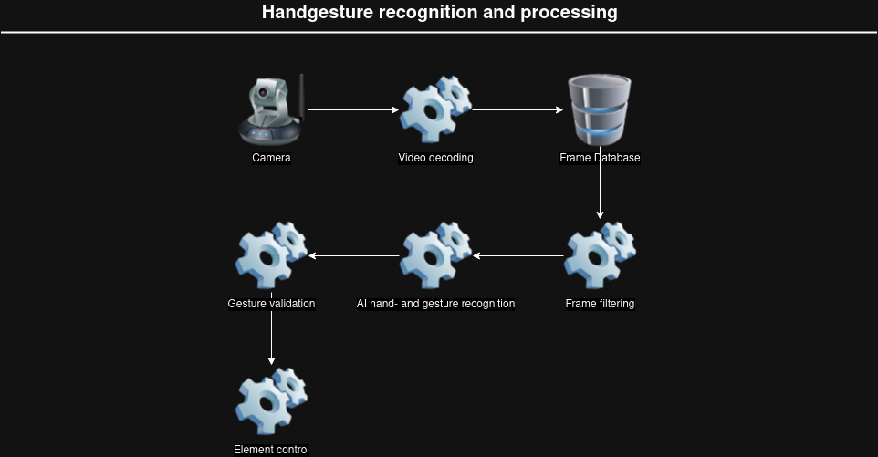

# SmartMirror

> A SmartMirror with lots of funktions including:
> - Weather Feed 
> - RSS Feed 
> - Calender (Google)
> - UI controlled by handgestures 
> - maybe even Voice assistant (depends on how sane I'll still be after implementing everything else...)

## Finding resources for what I want to implement...
- [x] GTK window with python
- [ ] Camera Input and normalization
- [x] gesture recognition with camera input
- [x] Calender (google, etc.)
- [x] RSS Feed for news 
- [ ] Voice assistant

 

### [Google Calender API](https://github.com/kuzmoyev/google-calendar-simple-api)

### [RSS Feed Parser for Python](https://www.tutorialspoint.com/python_text_processing/python_reading_rss_feed.html)

## How am I to go on about this project ???

(NYA)
